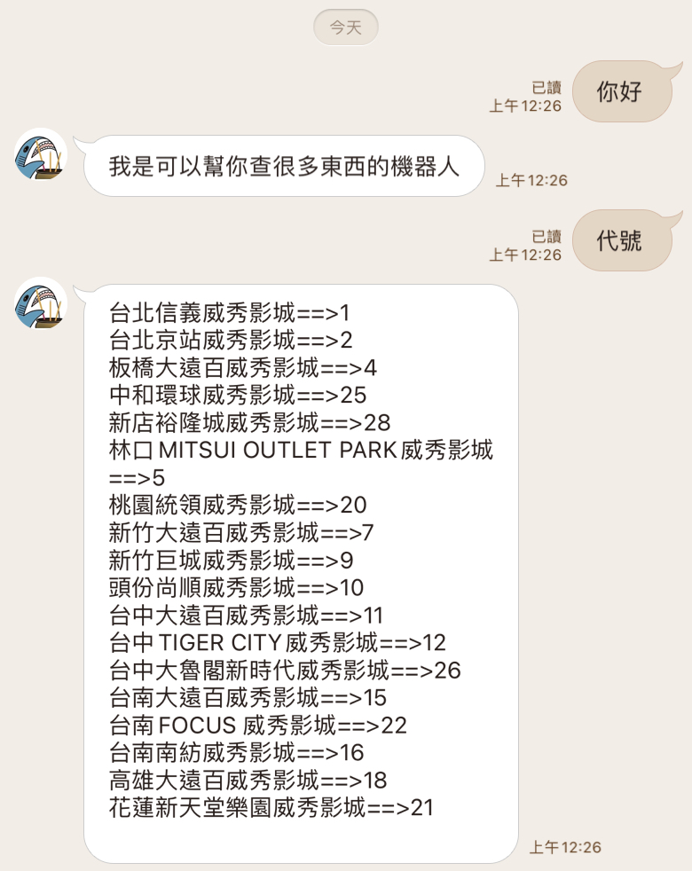
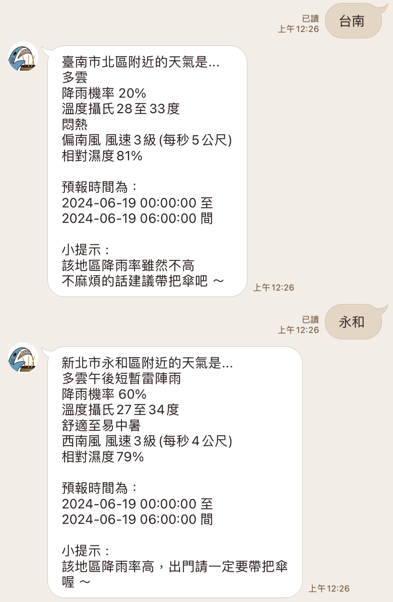
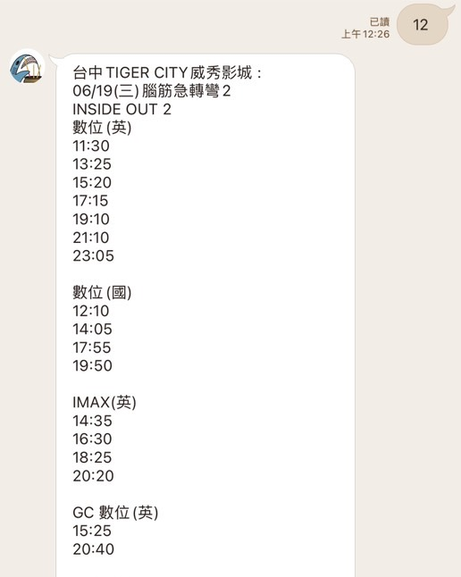

# LINE Bot Weather and Movie Schedule Query

本專案透過串接LINE Bot API並結合BeautifulSoup爬蟲技術，達成可使用LINE聊天室查詢各地區天氣（例如：永和、台南等）並且給予適當建議的回覆機器人。

除此之外，輸入特定編號（例如：12、22等）可查詢"威秀影城"所在縣市當日所播放之電影時刻表。

## 功能簡介

- **天氣查詢**：使用者可以在LINE聊天室中輸入地區名稱，機器人將回傳該地區的即時天氣資訊及適當建議。
- **電影時刻查詢**：使用者可以輸入特定編號查詢威秀影城在特定縣市當日所播放的電影時刻表。

## 使用技術

- **LINE Bot API**：用於與LINE平台進行互動，接收訊息並回覆。
- **BeautifulSoup**：用於爬取天氣資訊及電影時刻表的網頁數據。

## 如何使用

- 每日凌晨12:00 (每6小時) 執行/Weather/GetWeather.py。建議可自行設計為固定時間自動執行。
- app.py中的line_api等兩變數請自行輸入自己的Line token等
- GetWeather.py中的token亦同。

## 資料庫來源
- [交通部中央氣象局開放式資料庫](https://opendata.cwa.gov.tw/dataset/all/F-D0047-091)

## 使用畫面截圖

以下是實際使用畫面截圖：

## Demo影片

[詳細Demo影片](https://www.youtube.com/shorts/-zUP7ksWFlQ)
